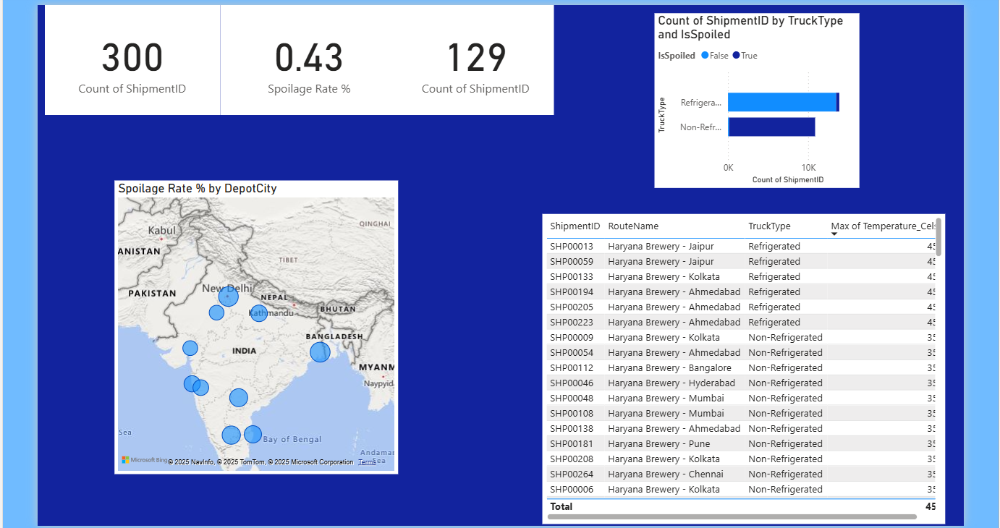

# AB InBev - Cold Chain Logistics Analysis

This is an end-to-end data analytics project that analyzes simulated supply chain data for a major beverage company to identify and reduce product spoilage.

**Dashboard** 

---

## Project Goal
The goal of this project was to analyze shipment and IoT sensor data to find the root causes of product spoilage in the supply chain and build a dashboard for management to monitor performance.

## Tools & Technologies
* **Language:** Python, SQL
* **Libraries:** Pandas, SQLAlchemy
* **Database:** MySQL
* **Visualization:** Power BI
* **Other:** Excel, Git/GitHub

## How to Run This Project
1.  Clone the repository.
2.  Set up the MySQL database using the `1_database_setup.sql` script.
3.  Create a virtual environment and install the dependencies from `requirements.txt` (`pip install -r requirements.txt`).
4.  Run the Python scripts in order (`1_generate_data.py`, `2_analysis.py`, etc.).
5.  Open the `Logistics_Dashboard.pbix` file in Power BI Desktop and refresh the data source.
